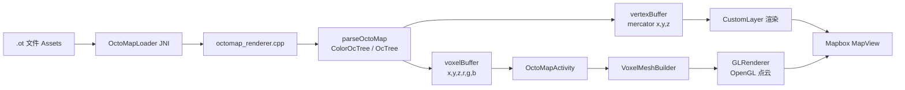

# OctoMap 技术原理图

## 数据流要点

- .ot 文件从 assets 读取，通过 JNI 进入原生解析
- 解析得到 ENU 坐标与颜色，写入 voxelBuffer 供 Kotlin 侧构建点云
- 同时生成 mercator 顶点用于 CustomLayer 叠加到 Mapbox
- GLRenderer 负责点云绘制，Mapbox 负责地图底图与相机同步

## 当前 .ot 文件与数据信息

### 文件信息

- 文件路径：app/src/main/assets/octoMap/20251127T173317_simple_color_tree.ot
- 文件大小：3.2M（3373459 bytes）
- 最后修改时间：2026-01-28 10:14
- 加载入口：OctoMapActivity.octoFileName

### 数据信息（运行时由 JNI 提供）

- 体素数量：getVoxelCount() = voxelBuffer.size / 6
- 体素分辨率：getResolution() 返回树分辨率
- 空间范围：getBoundsMin()/getBoundsMax() 返回 ENU 边界
- 颜色范围：r/g/b 存在 voxelBuffer，范围 0-1
- 坐标系：ENU 为本地坐标，Mapbox 渲染使用 Mercator

## 技术调研分析（可复用）

### 结论摘要

- 方案通用性：对标准 OctoMap 的 .ot 文件通用，可直接替换文件并显示
- 方案定位：适合中小规模点云/体素渲染，快速验证与可视化效率高
- 规模上限：大规模/长时运行需引入分块、分级、流式与缓存策略

### 机制通用性与适配范围

- 支持 ColorOcTree（带颜色）与 OcTree（无颜色）两类主流树结构
- 以 ENU 为本地坐标，结合 setOrigin 进行 WGS84/墨卡托映射
- 对不同 .ot 文件可直接替换，但需确保：
  - 文件格式为 OctoMap 标准序列化
  - 原点与数据所处地理位置匹配

### 是否主流方案

- 在移动端或轻量 3D 叠加场景，属于常见方案：解析在 JNI，渲染走 OpenGL 点云
- 若进入高保真或超大规模渲染，则通常转向：
  - 分块/分级（LOD）与按需加载
  - 引擎化渲染（如 Vulkan/Filament）以稳定资源管理与帧率

### 性能瓶颈与约束

- CPU 解析与内存占用：大 .ot 文件解析与缓冲区构建成本高
- JNI 数据搬运：超大数组会带来复制与 GC 压力
- GPU 渲染吞吐：点数量过大导致填充率与带宽瓶颈
- 相机同步频率：频繁刷新会放大渲染与数据更新成本

### 性能要求与规模建议

- 中小规模点云（数十万点）通常可用
- 百万级点云需要 LOD、裁剪或分块，否则帧率明显下降
- 长时间运行需要控制：
  - 常驻内存占用
  - 更新频率与每帧点数量

### 规模增大时的优化路径

- 分块与空间索引：按瓦片或八叉树层级加载
- 视锥裁剪与距离裁剪：只绘制可见体素
- LOD 分级渲染：远处低分辨率，近处高分辨率
- 异步解析与增量更新：避免主线程阻塞，减少全量重传
- GPU 缓存与淘汰策略：热点区域常驻，冷区回收

### 风险与注意事项

- 体素密度不均导致局部爆点，需做密度采样或阈值裁剪
- 数据坐标系混用会造成位置偏移，需统一 ENU 与地理参考
- 如果需要实时更新，必须控制数据吞吐与同步节奏
